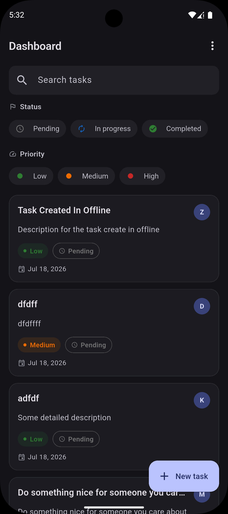
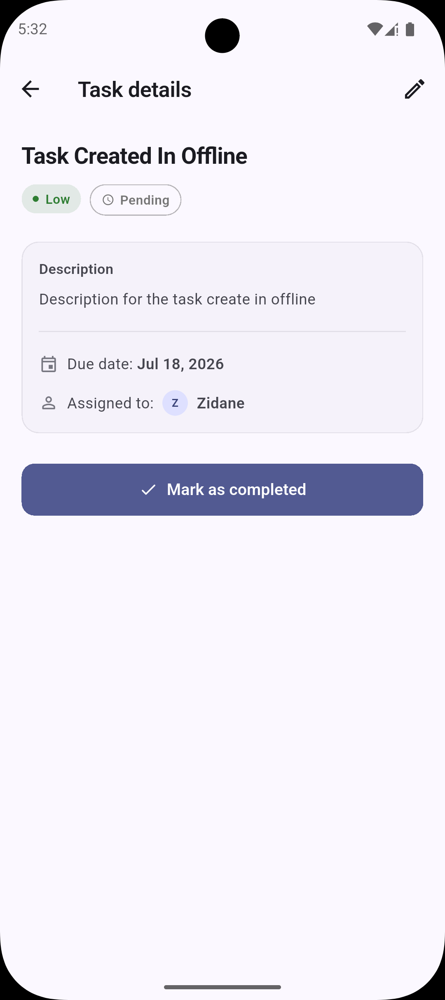
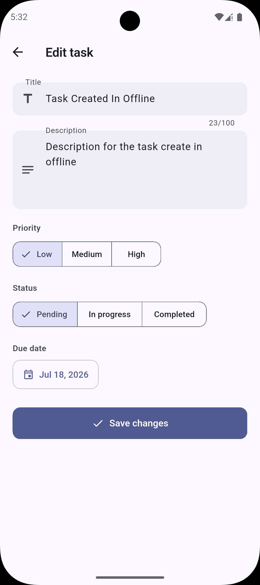
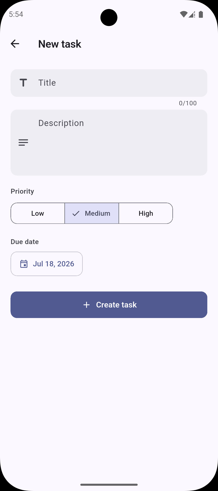

# Team Workspace

A task management app made in flutter. Email/password login
through Firebase, a paginated task dashboard backed by
[dummyjson.com](https://dummyjson.com/todos), offline-first writes with a
sync-status indicator, pull-to-refresh, search/filter, and a light/dark/system
theme switch.

## Setup instructions

### Prerequisites

- Flutter SDK — built against Flutter `3.44.6`

### 1. Install dependencies

```bash
flutter pub get
```

## Architecture overview

This follows a fairly standard feature-first Clean Architecture. The domain
layer is plain Dart, no Flutter, Dio, Firebase, Hive, or JSON imports, so it's
easy to test on its own. Repositories return a small hand-rolled `Result<T>`
(`Ok`/`Err`) instead of pulling in `dartz` just for one type.

```
lib/
  core/
    analytics/     # AnalyticsService abstraction, console impl, GoRouter screen-view observer
    di/            # hand-written get_it registration, Hive box names
    network/       # dio client config, DioException -> app exception mapping
    error/         # Failure types, Result<T>, app-level exceptions
    router/        # go_router config, auth-aware redirect
    theme/         # light + dark ThemeData, ThemeCubit (Hive-persisted mode)
    utils/         # log wrapper, date formatting, form validators
  features/
    auth/
      data/        # FirebaseAuthDataSource, AuthRepositoryImpl, error-code mapping
      domain/      # AppUser entity, AuthRepository contract, usecases
      presentation/ # AuthBloc, splash/login/sign-up pages
    tasks/
      data/        # dummyjson datasource + DTOs, Hive overlay/cache/queue, data models
                    # (TaskModel/AssignedUserModel + entity mappers), TaskRepositoryImpl
      domain/      # Task/AssignedUser entities (no serialization), TaskSaveOutcome,
                    # TaskEnrichment (deterministic derivation), usecases
      presentation/ # TaskListBloc, TaskDetailBloc, TaskFormBloc, pages, widgets

test/
  core/                              # DI lifecycle, DioException mapping, form validators
  features/auth/                    # AuthBloc, login/sign-up form validation
  features/tasks/data/              # repository overlay-merge, offline queue + sync status,
                                     # real-Hive round trips, data-model serialization
  features/tasks/domain/            # Task entity behavior
  features/tasks/presentation/      # TaskListBloc, TaskFormBloc, TaskFormView, dashboard states
```

One thing worth pointing out: the domain entities (`Task`, `AssignedUser`)
don't know anything about JSON. `@JsonSerializable` only shows up on the
data-layer models (`TaskModel`, `AssignedUserModel`, `TaskDto`), which handle
converting from the entities. Both Hive persistence and the dummyjson
API responses go through that data layer, so the blocs and everything above
them only ever deal with a plain `Task`.

## Packages used

Here's what's in `pubspec.yaml` and why:

| Package | Why |
|---|---|
| `flutter_bloc` | State management, one bloc per screen with explicit loading/success/failure states |
| `equatable` | Saves writing `==`/`hashCode` by hand for bloc events and states |
| `get_it` | Simple service locator, wired up in `injection.dart` |
| `dio` | HTTP client for the dummyjson API |
| `hive_ce` + `hive_ce_flutter` | Local storage for the overlay, cache, offline write queue, and theme setting. Went with the `_ce` fork since the original `hive` package isn't maintained anymore |
| `json_annotation` | Generates `toJson`/`fromJson` for the data-layer models and DTOs. Domain entities don't use it at all |
| `go_router` | Declarative routing with an auth-aware redirect and a screen-view observer |
| `intl` | Date formatting |
| `connectivity_plus` | Checks online/offline status for the write queue |
| `firebase_core` + `firebase_auth` | Email/password auth |
| `logger` | Wrapped in a small `log()` helper so there's no bare `print()` anywhere |
| `bloc_test` + `mocktail` (dev) | For testing blocs and the repository |
| `build_runner`, `json_serializable` (dev) | Codegen, only for `toJson`/`fromJson` |

## Assumptions made

- **Tasks support three statuses: pending, in progress, and completed.** Since DummyJSON only provides a `completed` boolean, the additional status is derived in `task_enrichment.dart` based on the task ID. When a completed task is reopened, it always goes back to **pending** instead of restoring its previous state.

- **The same `TaskFormBloc` and form UI are used for both creating and editing tasks.** The only distinction is whether `existingTask` is `null`. Because a new task doesn't have a status yet, the status selector is shown only while editing.

- **Form validation happens only when the user submits the form.** This behavior is consistent across login, sign-up, and create/edit task screens instead of validating on every keystroke.

- **Search input is debounced at the widget level** using a simple 300 ms `Timer`. Since the logic is UI-specific, no bloc-level stream transformer is used.

- **Create and update operations are treated as best-effort when online.** DummyJSON doesn't actually persist changes, so if the remote request fails after the task has already been saved locally, the failure is logged and queued for a later retry instead of showing an error to the user. The only time the user sees an error is when the local Hive write fails. The UI still clearly indicates whether the task was fully synced ("Task created") or only stored locally ("Saved locally. Will sync when online.") using the returned `TaskSaveOutcome`.

- **Pagination uses 10 tasks per page**, implemented with DummyJSON's `limit` and `skip` parameters to match the project requirements.

## Screenshots

A few screens from the app:

<table>
  <tr>
    <td><a href="Screenshot_1784376136.png"></a></td>
    <td><a href="Screenshot_1784376169.png"></a></td>
    <td><a href="Screenshot_1784376178.png"></a></td>
    <td><a href="Screenshot_1784377469.png"></a></td>
  </tr>
</table>